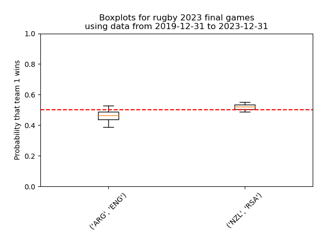
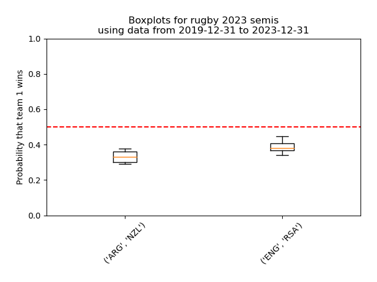
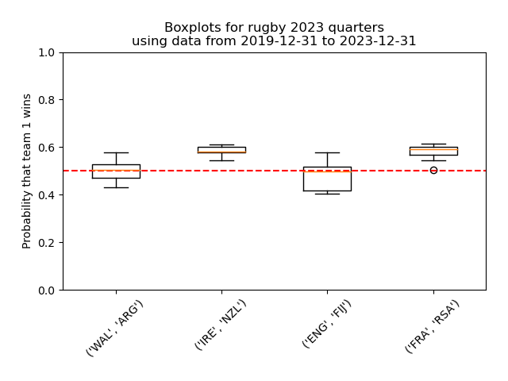
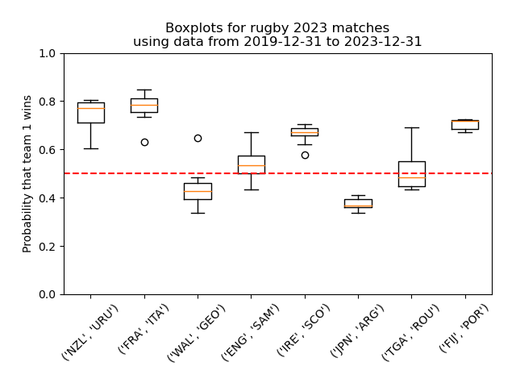
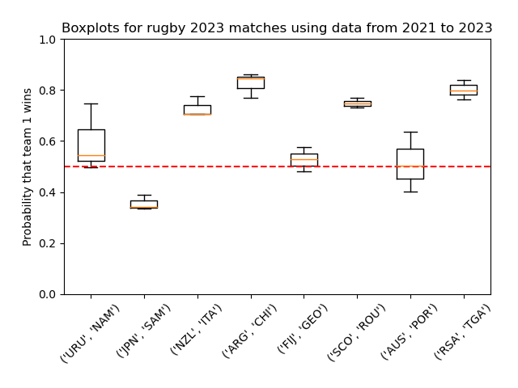

# Rugby 2023

## 231027: bets for finals

Plots for the two final games:



Slight advantages are visible in the boxplots, but we'll see what happens!

## 231023: semis results

The semi final games were both predictable! 
All in all I got 33 games right out of 46, a global success rate of 71.7%.

<details>
 <summary>Results of semi final games</summary>

My bets are in bold.

| Team 1 | Team 2 | Winner | 1 if the bet is right |
|--|--|--|--|
|ARG |**NZL**| **NZL**|1|
|ENG |**RSA** |**RSA**|1|

</details>


## 231019: bets for semis

Plots for semi finals bets:



Winners should be obvious... at least in the boxplots!

## 231016: quarters results

The quarter final games were a total miss for me, I got **zero** game right! 
All in all I still got 31 games right out of 44, a global success rate of 70.5%.

<details>
 <summary>Results of quarter final games</summary>

My bets are in bold.

| Team 1 | Team 2 | Winner | 1 if the bet is right |
|--|--|--|--|
|**WAL** |ARG| **ARG**|0|
|**IRE** |NZL |**NZL**|0|
|ENG |**FIJ** |**ENG**|0|
|**FRA** |RSA |**RSA**|0|

</details>


## 231012: bets for quarters

Plots for quarter finals bets:



There could be a surprise in... well at this point, anything goes!

## 231009: pool #5 results

So, how did it go with the fifth round? Well I got 75% of winners right (6 out 8). The surprise (POR) did not come from where I thought (ROU).
All in all I got 31 games right out of 40, so **77.5% success rate for the pool games!** Yay for me.

<details>
 <summary>Results of round 5 of pool games</summary>

My bets are in bold.

| Team 1 | Team 2 | Winner | 1 if the bet is right |
|--|--|--|--|
|**NZL** |URU| **NZL**|1|
|**FRA** |ITA |**FRA**|1|
|**WAL** |GEO |**WAL**|1|
|**ENG** |SAM |**ENG**|1|
|**IRE** |SCO |**IRE**|1|
|JPN |**ARG** |**ARG**|1|
|TGA |**ROU** |**TGA**|0|
|**FIJ** |POR |**POR**|0|

</details>


## 231002: bets for pool #5

Plots for pool #5 games bets:



There could be a surprise in WAL-GEO, ENG-SAM and TGA-ROU.

New: Models are built used time periods that make some sense, from 2020 to today (roughly, 6 months intervals). Also, refactored.

Future work: Do backtesting. Use other modeling possibilities (in `choix`, or find other implementation).

## 231002: pool #4 results

So, how did it go with the fourth round? Well I got 87.5% of winners right (7 out 8).
All in all I got 25 games right out of 32, so 78% success rate so far.

<details>
 <summary>Results of round 4 of pool games</summary>

My bets are in bold.

| Team 1 | Team 2 | Winner | 1 if the bet is right |
|--|--|--|--|
|**URU** |NAM| **URU**|1|
|JAP |**SAM** |**JAP**|0|
|**NZL** |ITA |**NZL**|1|
|**ARG** |CHI |**ARG**|1|
|**FIJ** |GEO |**FIJ**|1|
|**SCO** |ROM |**SCO**|1|
|**AUS** |POR |**AUS**|1|
|**RSA** |TGA |**RSA**|1|

</details>


## 230928: box and whiskers plots!

In the last few days I managed to hack my way to where I wanted to go:

- looking back in time, use an increasing quantity of data to fit several Bradley-Terry models
- use those models to generate several win probabilities for the same event
- make boxplots!

Here is a beautiful plot for pool #4 bets:



Note to self: 3 numbers are not enough to make a boxplot! Also, using one-year increments to go back in time makes no particular sense.

(Also, refactored the python files.)

## 230925: basic pool #4 bets

For this new round of pool games, we see that the bets are sometimes different when using rankings or B-T.

<details>
 <summary>Pool #4 games</summary>

```
** FROM RATINGS **
URU 99.1% -- NAM 0.8%
JPN 23.2% -- SAM 76.7%
NZL 99.9% -- ITA 0.0%
ARG 99.9% -- CHI 0.0%
FIJ 99.9% -- GEO 0.0%
SCO 99.9% -- ROU 0.0%
AUS 99.8% -- POR 0.1%
RSA 99.9% -- TGA 0.0%
** FROM BRADLEY-TERRY **
URU 43.2% -- NAM 56.7%
JPN 61.9% -- SAM 38.0%
NZL 91.7% -- ITA 8.2%
ARG 83.6% -- CHI 16.3%
FIJ 49.5% -- GEO 50.4%
SCO 59.2% -- ROU 40.7%
AUS 80.7% -- POR 19.2%
RSA 83.7% -- TGA 16.2%
```
</details>

Notes to self: There are many algorithms in `choix`. URU-NAM still seems off in BT. Also need a way to take draws into account.

## 230925: pool #3 results

So, how did it go with the third round? Well I got 62.5% of winners right (5 out 8). 
All in all I got 18 out of 24, so 75% right so far.

<details>
 <summary>Results of round 3 of pool games</summary>

My bets are in bold.

| Team 1 | Team 2 | Winner | 1 if the bet is right |
|--|--|--|--|
|**ITA** |URU| **ITA**|1|
|**FRA** |NAM |**FRA**|1|
|**ARG** |SAM |**ARG**|1|
|**GEO** |POR |**POR**|0|
|**ENG** |CHI |**ENG**|1|
|**RSA** |IRE |**IRE**|0|
|**SCO** |TGA |**SCO**|1|
|WAL |**AUS** |**WAL**|0|

</details>

## 230919: Make your own kind of rankings
I've been doing it wrong since day one. The ranking score given by World Rugby are not good input to `choix` lib, as they were not computed by Bradley-Terry.
Those 99.9% looked too good to be true, of course. So: I downloaded past games scores (2013 onwards, maybe it's too much), computed the rankings properly , and computed probabilities properly. Also, refactoring of the code. Here are new numbers that make more sense.

<details>
 <summary>Pool #3 games - sensible!</summary>

```
ITA 49.8% -- URU 50.1%
FRA 74.9% -- NAM 25.0%
ARG 62.5% -- SAM 37.4%
GEO 72.7% -- POR 27.2%
ENG 93.1% -- CHI 6.8%
RSA 50.5% -- IRE 49.4%
SCO 71.2% -- TGA 28.7%
WAL 45.7% -- AUS 54.2%
```

</details>

Notes to self: I still need some sort of confidence interval. Also some data cleaning would be nice, maybe use only past matches from teams that actually compete in the world cup - the bets on ITA-URU seem off, maybe that's due to bad data. See `scrape-matches.py` for the calls to a nice API that has loads of past data.

## 230918: Pool #3 games

Here they are, done with the latest ratings. Three games look undecided.

<details>
 <summary>Pool #3 games!</summary>

```
ITA 99.9% -- URU 0.0%
FRA 99.9% -- NAM 0.0%
ARG 80.1% -- SAM 19.8%
GEO 99.6% -- POR 0.3%
ENG 99.9% -- CHI 0.0%
RSA 46.1% -- IRE 53.8%
SCO 99.9% -- TGA 0.0%
WAL 84.0% -- AUS 15.9%
```

</details>

## 230918: Results pool 2
So, how did it go with the second  phase? Well I got 87.5% of winners right (7 out 8). Admittedly this round 2 was not surprising except for FIJ which seems to be a real outlier performer! All in all I got 13 out of 16, so 81.25% right so far.

<details>
 <summary>Results of second round of pool games</summary>

My bets are in bold.

| Team 1 | Team 2 | Winner | 1 if the bet is right |
|--|--|--|--|
|**FRA** |URU| **FRA**|1|
|**NZL** |NAM |**NZL**|1|
|**SAM** |CHI |**SAM**|1|
|**WAL** |POR |**WAL**|1|
|**IRE** |TGA |**IRE**|1|
|**RSA** |ROU |**RSA**|1|
|**AUS** |FIJ |**FIJ**|0|
|**ENG** |JPN |**ENG**|1|

</details>

## 230912: Bets on pool #2

Here they are, done with the latest ratings. Seems all straightforward, but who knows what will happen?

<details>
 <summary>Pool #2 games!</summary>
 
```
FRA 99.9% -- URU 0.0%
NZL 99.9% -- NAM 0.0%
SAM 99.9% -- CHI 0.0%
WAL 99.9% -- POR 0.0%
IRE 99.9% -- TGA 0.0%
RSA 99.9% -- ROU 0.0%
AUS 98.0% -- FIJ 1.9%
ENG 99.9% -- JPN 0.0%
```

</details>

Notes to self: What I would like to do - get some sort of confidence interval. Maybe use historical data to compute my own ranking, using Bradley-Terry, which is what I wanted to do initially. By using more or less historical data, I could make several models, and get a confidence interval like that.

## 230912: After first phase of pool games
So, how did it go with the first phase? Well I got 75% of winners right (6 out 8)

<details>
 <summary>Results of first round of pool games</summary>

My bets are in bold.

| Team 1 | Team 2 | Winner | 1 if the bet is right |
|--|--|--|--|
|**FRA** |NZL| **FRA**|1|
|**ITA** |NAM |**ITA**|1|
|**IRE** |ROU |**IRE**|1|
|**AUS** |GEO |**AUS**|1|
|ENG |**ARG** |**ENG**|0|
|**RSA** |SCO |**RSA**|1|
|WAL |**FIJ** |**WAL**|0|
|**JPN** |CHI |**JPN**|1|

</details>

## 230907: One day to go

OK I'm super late since it starts tomorrow!

Links I found useful:
- Official rankings, but hard to use as is: https://www.world.rugby/tournaments/rankings/mru
- API to get the rankings in json form: https://api.wr-rims-prod.pulselive.com/rugby/v3/rankings/mru
- Sourced from https://github.com/rawling/wr-calc/ and https://rawling.github.io/wr-calc/


Got the World Rankings and points in json, parsed them, then used `choix` to generate probabilities of win for all possible games. I used this tutorial: https://github.com/lucasmaystre/choix/blob/master/notebooks/intro-pairwise.ipynb

Then, simply print probabilities as % for the pool games.
GPT sped me up a lot, I used it as a coding assistant.

Next, I would like to see whether the points ranking from the Rugby world site is really a good input for `choix`, and get some kind of confidence interval. Additionally I could generate my own parameters based on past games, that would be more in the Bradlet-Terry spirit.

By the way, here are the predictions: 

<details>
 <summary>Pool games!</summary>
 
```
FRA 54.1% -- NZL 45.8%
ITA 99.9% -- NAM 0.0%
IRE 99.9% -- ROU 0.0%
AUS 97.4% -- GEO 2.5%
ENG 28.6% -- ARG 71.3%
RSA 99.9% -- SCO 0.0%
WAL 11.6% -- FIJ 88.3%
JPN 99.9% -- CHI 0.0%
FRA 99.9% -- URU 0.0%
NZL 99.9% -- NAM 0.0%
IRE 99.9% -- TGA 0.0%
WAL 99.9% -- POR 0.0%
SAM 99.9% -- CHI 0.0%
RSA 99.9% -- ROU 0.0%
AUS 39.8% -- FIJ 60.1%
ENG 99.8% -- JPN 0.1%
ITA 99.9% -- URU 0.0%
FRA 99.9% -- NAM 0.0%
ARG 99.0% -- SAM 0.9%
RSA 32.2% -- IRE 67.7%
GEO 99.9% -- POR 0.0%
ENG 99.9% -- CHI 0.0%
SCO 99.9% -- TGA 0.0%
WAL 16.6% -- AUS 83.3%
URU 99.3% -- NAM 0.6%
JPN 5.2% -- SAM 94.7%
NZL 99.9% -- ITA 0.0%
SCO 99.9% -- ROU 0.0%
FIJ 98.2% -- GEO 1.7%
ARG 99.9% -- CHI 0.0%
AUS 99.9% -- POR 0.0%
NZL 99.9% -- URU 0.0%
FRA 99.9% -- ITA 0.0%
IRE 99.9% -- SCO 0.0%
WAL 88.3% -- GEO 11.6%
ENG 97.7% -- SAM 2.2%
TGA 99.6% -- ROU 0.3%
FIJ 99.9% -- POR 0.0%
JPN 0.0% -- ARG 99.9%
```

</details>

## 230831: Introduction

The Rugby World cup is about to start, and I have been invited to a betting league by my colleagues.
I have been using random Excel formulas for years to predict outcomes in the Football world cups, with limited success.
This time I want to explore how to generate sensible bets in a data-driven fashion. This is my journal. Yay!

So, first thing, I remembered my ex-colleague Dr. Fabien Llobell explained how to predict winners for the football world cup in 2022.
He is head of research at the company that sells a widely used statistics plugin for Excel (disclaimer: I used to work there too), so for sure he knows what he's talking about. Here is his write-up: https://medium.com/xlstat/football-score-predictions-with-the-bradley-terry-model-e0a8a7ebfd83

So, the take-away is: use the Bradley-Terry model. Fine. I want to understand what this model does, how it works. I want to generate a probability of winning the next game for arbitrary teams, with confidence level. And I want to do it in Python.

Here are a few pointers that seem of interest.

- Mandatory Wikipedia link: https://en.wikipedia.org/wiki/Bradley%E2%80%93Terry_model
- Of course R has a sophisticated implementation. Reading this page will help: https://www.r-bloggers.com/2022/02/what-is-the-bradley-terry-model/
- This guy has Jupyter notebooks that seem to do just what I want. This should be useful: https://github.com/sezenack/Bradley-Terry-Sports-Model
- `choix` is a Python lib that has a Bradley-Terry implementation, with tutorials. High hopes for this: https://github.com/lucasmaystre/choix

OK that should be good starting points. Of course, I also want to use GPT to help me out. Let's see how this goes.
